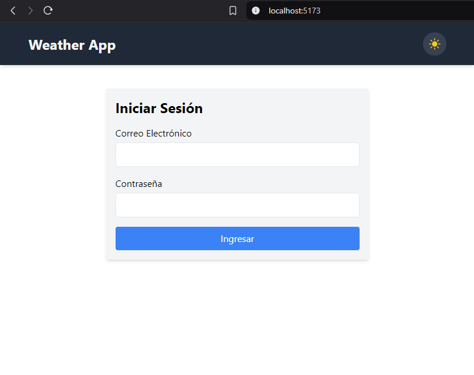
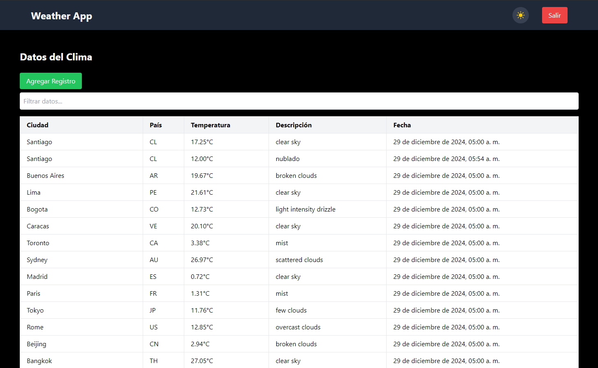

## Documentación del Proyecto - Weather App

Weather App es una aplicación web que permite a los usuarios:

* Ver información meteorológica protegida mediante autenticación.
* Agregar nuevos registros meteorológicos a la base de datos.
* Alternar entre los modos claro y oscuro.
* Cerrar sesión de manera segura.


## Visual




## Tecnologías Utilizadas

### Frontend
* React con TypeScript: Framework para construir la interfaz de usuario.
* Vite: Herramienta rápida de desarrollo para React.
* TailwindCSS: Framework CSS para diseño rápido y responsivo.
* TanStack Query: Para la gestión de datos y solicitudes asíncronas.
* Axios: Cliente HTTP para interactuar con el backend.
* Heroicons: Iconos SVG para mejorar la UI.
Backend
* Node.js con Express: Framework para construir el backend.
* MySQL: Base de datos relacional para almacenar datos meteorológicos y usuarios.
* JWT: Para la autenticación y autorización segura.
* Bcrypt.js: Para cifrar contraseñas de usuarios.
DevOps
* Docker: Para contenerizar la base de datos MySQL.
* Thunder client: Para pruebas de las rutas del backend.


## Estructura del proyecto

### Frontend

```plaintext
src/
├── api/
│   ├── auth.ts              # Lógica para autenticación
│   └── weather.ts           # Lógica para solicitudes de datos meteorológicos
├── components/
│   ├── AddWeatherModal.tsx  # Modal para agregar registros meteorológicos
│   ├── Navbar.tsx           # Barra de navegación con botón de logout y switch de tema
│   └── WeatherTable.tsx     # Tabla dinámica con TanStack Table
├── context/
│   └── ThemeContext.tsx     # Contexto para manejar el tema claro/oscuro
├── pages/
│   ├── Dashboard.tsx        # Página principal que muestra los datos meteorológicos
│   └── LoginPage.tsx        # Página de inicio de sesión
├── App.tsx                  # Enrutador principal
├── main.tsx                 # Punto de entrada del proyecto
├── index.css                # Estilos globales
└── vite-env.d.ts            # Configuración de TypeScript
```

### Backend

```plaintext
src/
├── middleware/
│   └── authMiddleware.ts    # Middleware para verificar el token JWT
├── routes/
│   ├── auth.ts              # Rutas para login y registro de usuarios
│   └── weather.ts           # Rutas para gestionar los datos meteorológicos
├── services/
│   ├── userService.ts       # Lógica de manejo de usuarios
│   └── weatherService.ts    # Lógica de manejo de datos meteorológicos
├── database.ts              # Configuración de conexión con MySQL
├── app.ts                   # Configuración principal del servidor
├── .env                     # Variables de entorno (DB_HOST, DB_USER, JWT_SECRET, etc.)
└── docker-compose.yml       # Configuración de Docker para MySQL
```

## Endpoints

### Auth

* POST /auth/register: Registra un nuevo usuario.
* POST /auth/login: Autentica un usuario y devuelve un token JWT.
### Weather

* GET /weather: Devuelve los datos meteorológicos (protegido).
* POST /weather: Agrega un nuevo registro meteorológico (protegido).